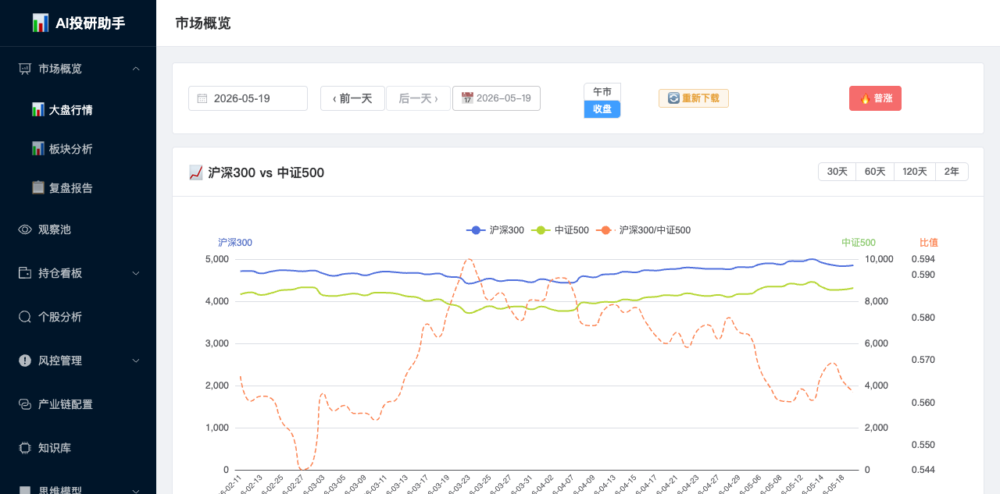
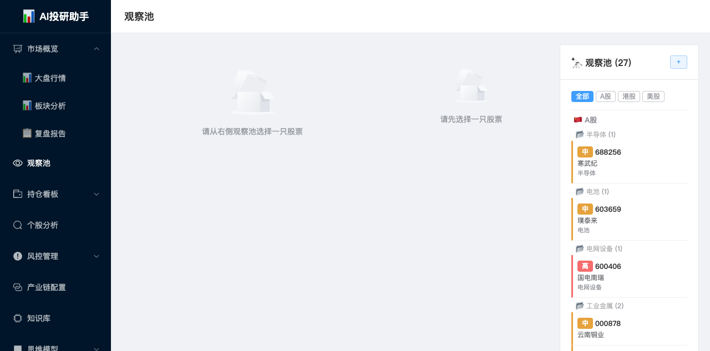
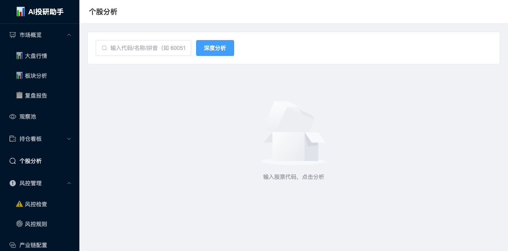
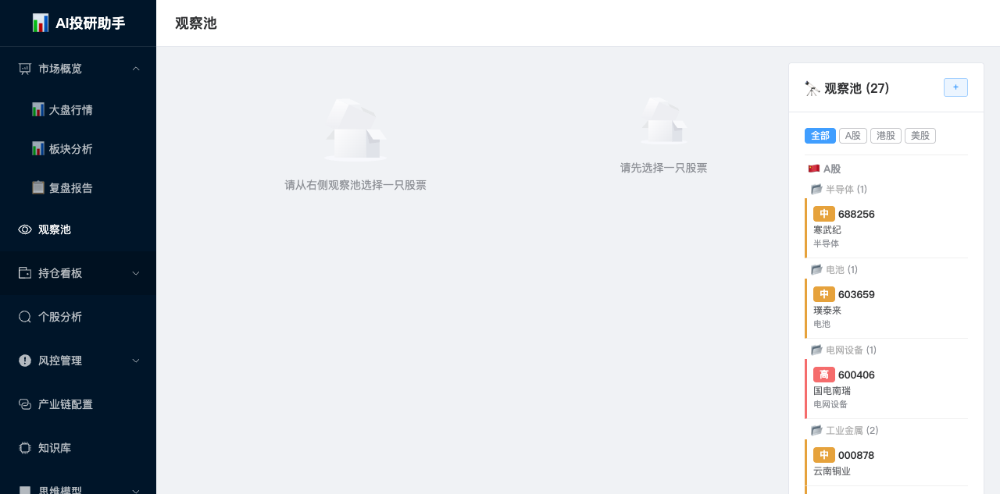
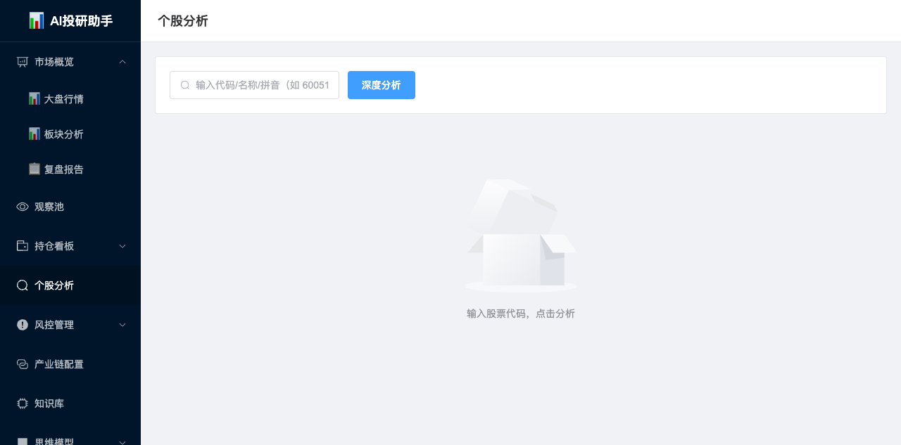
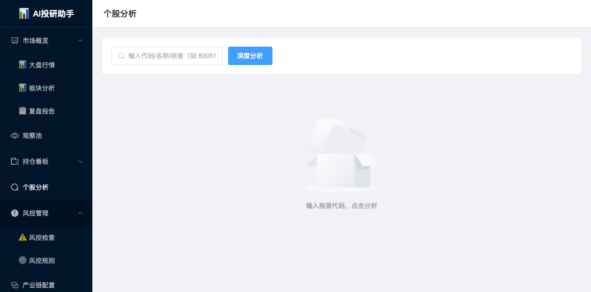

# AI投研助手

金融AI投研助理 — 复盘、持仓、分析、风控

## 功能预览

### 📊 市场概览

大盘行情总览：涨跌家数、涨停跌停、涨幅/跌幅 TOP10、热门板块排行。



### 🔭 观察池

自选股池管理：K线图、技术指标、基本面、行业前瞻、操作笔记。



### 📊 板块分析

板块周期研判：市场整体判定、相位分布、相位推演、关注板块、主线逻辑（AI动态摘要）、各板块周期相位表。



### 💼 持仓看板

持仓明细、盈亏分析、主题分布、行业配置。



### 🔍 个股分析

个股多维度分析：技术面、基本面、行业面、AI预测。



### ⚠️ 风控管理

持仓风控检查、规则管理、风险预警。



### 📋 Cron任务

后台任务管理：手动触发收盘数据/午盘快照/复盘日报/板块分析/午盘分析，历史记录查询。


## 技术栈

- **后端**: Python FastAPI + SQLite
- **前端**: Vue 3 + Element Plus + ECharts
- **数据**: akshare（东方财富接口）
- **AI**: DeepSeek API（动态摘要生成）

## 启动

```bash
cd frontend && npm run build
cd ..
python3 run.py
```

访问 http://localhost:8080
